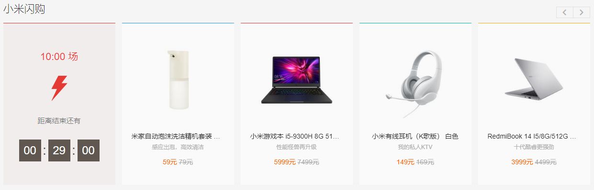
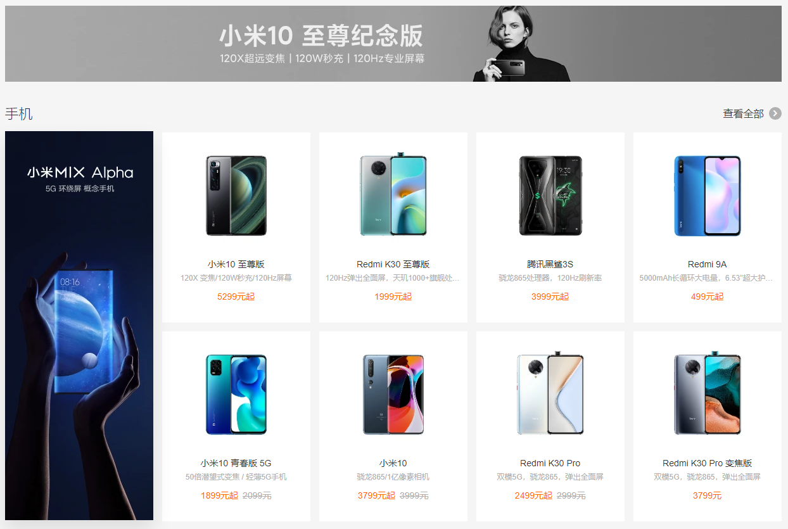

## 介绍
本项目模仿小米商城的布局，属于练手项目，用于提升自己的 css 水平

## 小米商城
> https://www.mi.com/index.html




## 完成效果


## 小米商城首页数据爬取代码
在浏览器 `console` 执行以下代码
```javascript
let banners = document.querySelectorAll('.home-banner-box');
let dataList = [];
banners.forEach((bannerItem)=>{
    let bannerHref = bannerItem.querySelector('a').href;
    let bannerSrc = bannerItem.querySelector('img').dataset.src;
    let category = bannerItem.nextElementSibling;
    let title = category.querySelector('.box-hd .title').innerText;
    let goodsCard = category.querySelectorAll('.brick-list .brick-item');
    let posters = category.querySelectorAll('.brick-promo-list > .brick-item');
    let more = category.querySelectorAll('.brick-list .brick-item .more')
    let oneCategory = {
        title: title,
        banner: {
            src: bannerSrc,
            href: bannerHref
        },
        mode: "double",
        showMore: !!more,
        data: {
            posters: [],
            goods: []
        }
    };
    goodsCard.forEach((item)=>{
        if(item.querySelector('.more')) {
            return;
        }

        let originPrice = item.querySelectorAll('.price .num')[1];
        oneCategory.data.goods.push({
            href: item.querySelector('a').href,
            src: item.querySelector('.figure img').dataset.src,
            name: item.querySelector('.title').innerText,
            desc: item.querySelector('.desc')?.innerText || '',
            price: item.querySelectorAll('.price .num')[0].innerText + '元',
            originPrice: originPrice ? (originPrice.innerText + '元') : '',
        });
    }
    );

    posters.forEach((item)=>{
        oneCategory.data.posters.push({
            href: item.querySelector('a').href,
            src: item.querySelector('img').dataset.src
        })
    }
    );
    dataList.push(oneCategory);
}
);

console.info(dataList);
```